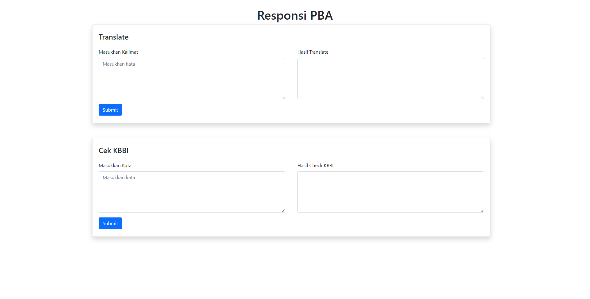

# Translate dan Check KBBI dengan Flask
Program Responsi Praktikum Pemrosesan Bahasa Alami menggunakan Flask. Program ini menggunakan library dari flask, googletrans, kbbi, dan Sastrawi.

### Screenshot 

**NOTE**
Jika ingin menggunakan repo ini, buat terlebih dahulu file yang berisi authentikasi untuk website KBBI (https://kbbi.kemdikbud.go.id). Untuk lebih jelas, bisa dilihat di dokumentasinya (https://github.com/laymonage/kbbi-python).
